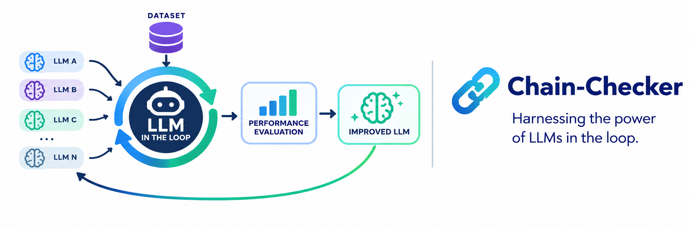
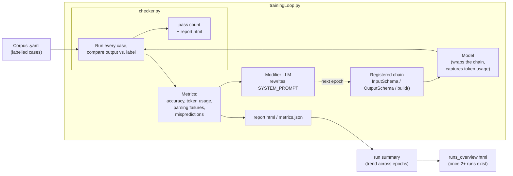

# Chain Checker 🔗︎ — Harnessing the power of LLMs in the loop

<p align="center">
  <picture>
    
  </picture>
</p>

<p align="center">
  
  
  
  
  
</p>


## What it does

- **`bin/checker.py`** — one pass over a corpus, comparing each case's
  expected output against the chain's real output, key by key:

  ```
  (.venv)➜backend python bin/checker.py
      (CHECKER) Running checker
      (CHECKER)   config: 'chain_checker/config.json'
      (CHECKER)   type: '<type>' (config)
      (CHECKER)   chain-type: 'template_checklist' (default)
      (CHECKER)   chain-tier: chain's own default (default)
      (CHECKER)   file: 'workflows/<type>/template_checklist.yaml' (config)
      (CHECKER)   prompt-file: none (default)

      (CHECKER) Evaluating case (1)/(9) case-1...
      (CHECKER) Evaluating case (2)/(9) case-2...
      ...
      (CHECKER) 8/9 cases passed
      (CHECKER)-(REPORT) Report written to workflows/<type>/.temp/template_checklist/check_0/report.html
  ```

- **`bin/trainingLoop.py`** — For a chain written to modify a rewritable system prompt, it can also drive an LLM-in-the-loop: every epoch it scores the chain, instructs a **modifier**
LLM to rewrite the prompt — then scores the new prompt
next epoch, and repeats. The goal is a prompt that scores higher without
costing more tokens, found automatically instead of by hand-editing and
re-running.

  ```
  (.venv)➜backend python bin/trainingLoop.py
      (R)-(MODIFIER) Starting a new run: workflows/<type>/.temp/template_checklist/run_0
      (R)-(MODIFIER) Running epoch 1/4...
      (R)-(MODIFIER) epoch 1/4 done - overall accuracy of 0.75, chain used 6840 tokens across 9 call(s) (avg 760.0/entry)
      (R)-(MODIFIER) Generating new prompt
      (R)-(MODIFIER) epoch 1/4 modifier LLM used 1180 tokens rewriting the prompt (cumulative across all epochs so far: 1180)
      ...
      (R)-(MODIFIER) Summary updated at workflows/<type>/.temp/template_checklist/run_0/summary/report.html
  ```

  See [Usage](documentation/USAGE.md) for every flag, config files, resuming


## Documentation

| Goal | Start here |
|---|---|
| Run a chain once against a corpus, or train its prompt automatically | [Usage](documentation/USAGE.md) |
| Write or register a chain `bin/checker.py` can test | [Checker Chain Requirements](documentation/CHECKER-CHAIN-REQUIREMENTS.md) |
| Write or register a chain `bin/trainingLoop.py` can train | [Loop Chain Requirements](documentation/LOOP-CHAIN-REQUIREMENTS.md) |
| Write a corpus `.yaml` | [Dataset Requirements](documentation/DATASET-REQUIREMENTS.md) |
| Understand what the modifier LLM reads each epoch and which note is attached when | [Modifier Prompt](documentation/MODIFIER-PROMPT.md) |


## How it fits together


Everything in the flow diagram happens automatically when calling either (**`checker`**) or (**`trainingLoop`**)

## Host project

Chain Checker is a package that lives inside a host Django project, not a
standalone tool. This repository is the package itself: clone it into
a folder named `chain_checker` on the host's import path, since every module
imports its siblings as `chain_checker.*`:

```
git clone https://github.com/SchwarzRene/chain-checker.git chain_checker
```

The host supplies:

- the entry points `bin/checker.py` and `bin/trainingLoop.py`, which parse
  arguments and call into this package;
- `core.appconfig.ChainAppConfig`, the Django app config base class whose
  `llm(tier)` hands out a LangChain chat model per tier;
- `core.registry.registry`, where chains register their
  `InputSchema` / `OutputSchema` / `build()`;
- `settings.LITELLM_BASE_URL` and a `LITELLM_API_KEY_<APP>` per app when the
  LiteLLM modifier backend is used.

The Ollama modifier backend needs only a reachable Ollama server.
