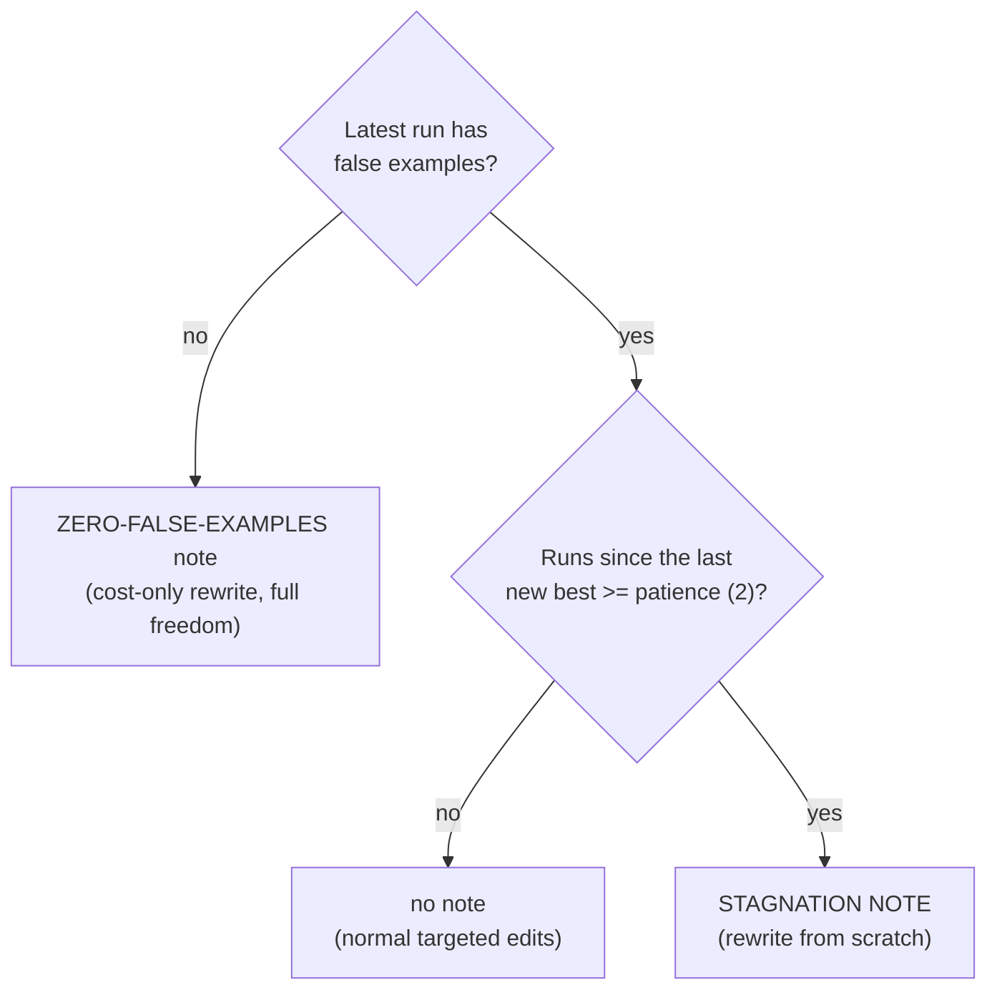

# Modifier Prompt

What the modifier LLM actually reads on every epoch of `trainingLoop.py`, in which order the pieces are put together, and which extra note gets attached when.
Code lives in `modifier/model/` — `instructions.py` holds the fixed text, `modifier_model.py` puts it together, `extraction.py` pulls the new prompt out of the reply.

---

## How one epoch works

1. **Record** → `modify()` calls `replay_run()` first: this epoch's prompt and metrics become one new run record. The record is kept raw and rendered on every build, because which runs are shown in full decides where a case's input is printed.
2. **Build** → `_build_instruction()` glues the fixed instructions, the run blocks that are still shown, the RULE-TREND table, the steering notes and at most one closing note together (order below).
3. **Ask** → the whole text goes to the modifier LLM in one call. No chat history, no second turn.
4. **Extract** → the new prompt is cut out of the reply and becomes the chain's `SYSTEM_PROMPT` for the next epoch.

`--continue` goes through `replay_run()` only, for every past epoch, without calling the LLM. So a resumed loop sends the same history a non-stopped loop would.

---

## Order of the instruction

| # | Block | Built by | Included |
|---|---|---|---|
| 1 | System instructions | `build_system_instructions()` | always |
| 2 | `METRIC-DEFINITIONS` | `_format_metric_definitions()` | when at least one metric has a `description` |
| 3 | `Run-0` … `Run-<N>` | `_format_run_block()` | one per epoch so far, oldest first; old runs shrink to a stub, see [History pruning](#history-pruning) |
| 4 | `RULE-TREND` | `format_rule_trend()` | when a run reports per-rule accuracy (multi-rule chains) |
| 5 | Steering notes | `measurement_note()` / `base_run_note()` / `length_budget_note()` | each when its input is known, see [Steering notes](#steering-notes) |
| 6 | Closing note | `zero_false_examples_note()` / `stagnation_note()` | at most one, see [Closing notes](#closing-notes) |
| 7 | `NEW-LLM-PROMPT` marker | `_build_instruction()` | always, last line |

The modifier's reply starts right after the marker, so the marker is the "write here" line.

---

## 1. System instructions

A fixed text. The only part that changes per chain is the placeholder paragraph.

| Section | Tells the modifier |
|---|---|
| `ROLE` / `TASK` | Write a new, better system prompt that scores higher than every prompt so far. The modifier owns the whole text: reword, reorder, restructure, add, delete or replace all of it. Only the output format is fixed. By default as little changes as one hypothesis needs. Judge only from the reports, not from what you assume the task is. |
| `RUN HISTORY` | What each block of a run means and how to read it (LLM-PROMPT, ACCURACY-REPORT, FALSE-EXAMPLES-REPORT, PARSE-FAILURE-REPORT, RULE-TREND). |
| Latest run vs. earlier runs | Diagnose from the latest run. Earlier runs show what was tried, and a rule's wording from a better earlier run may be restored verbatim. |
| `DIAGNOSIS` | 1. parse failures first · 2. every false example against the wording that governs it, fix by making the test simpler · 3. look for a hidden pattern the wording never states · 4. read the error direction in RULE-TREND · 5. ids wrong in every run are probably bad labels |
| `REWRITING` | **BASE** build on the best run, not the latest · **ONE HYPOTHESIS** change only what it touches, copy the rest verbatim · **PATTERNS, NOT CASES** a change needs a pattern shared by several failures, never quote or name inputs · **EVIDENCE STRENGTH** a couple of cases is noise · **LENGTH** no net growth, add by merging or deleting · structural rewrite only if the structure itself confuses the target model. Keep wording that passes. Commit, don't hedge. Handed over to the STAGNATION NOTE when one is attached. |
| Placeholder note | Chain has `{placeholder}` tokens → keep them as tokens (refilled each run) or freeze today's value in. No tokens → one line saying so. |
| `GOALS` | 1. accuracy always wins · 2. cost (tokens) is the tie-breaker only once there are no false examples left |
| `MANDATORY` | 1. keep the output-format instructions · 2. reasoning only inside `<think>…</think>`, then only the complete new prompt (never a diff) · 3. never write a marker/tag/heading |

---

## History pruning

The instruction used to grow by one full run per epoch (118 KB at Run-0, 224 KB at Run-7 in one real loop). Now only these runs are printed in full:

- the latest `DEFAULT_RECENT_RUNS_SHOWN` runs (2)
- the best run overall, the base for the next rewrite
- the best run of each rule, whose wording may be restored for that rule

Every other run is one line: `(omitted to save space - accuracy 0.612; ...)`. A case's input is printed in full by the first *shown* run that mispredicts it, so dropping a run never loses an input. `RULE-TREND` still covers every run.

---

## Steering notes

Attached after RULE-TREND. They push the modifier toward small steps from the best prompt, which is what makes the score climb instead of wander. The numbers come from code, the wording stays task-independent.

| Note | Says | Input | Left out when |
|---|---|---|---|
| `MEASUREMENT NOTE` | each value was scored on N cases, one case moves it by 1/N, re-running the same prompt moves the overall score by about the stagnation tolerance, so a few cases are noise | case count from the latest run's confusion counts | no per-rule counts (single-criterion chain) |
| `BASE NOTE` | Run-K scored best and the latest run did not beat it: write Run-K's prompt plus one change | best run by accuracy, earliest wins a tie | the latest run is the best |
| `LENGTH BUDGET` | the base prompt has N characters, stay near N × (1 + `DEFAULT_LENGTH_GROWTH`) (10%), add by merging or deleting | length of the best run's prompt | no run has an accuracy |

`ModifierModel(recent_runs_shown=..., length_growth=...)` sets the pruning window and the growth allowance.

---

## 2. METRIC-DEFINITIONS

One line per metric that has a `description`, so the `## <metric-name>` headers in the runs have a meaning.

```
<-----------------METRIC-DEFINITIONS----------------->
- Accuracy-Metrics: share of cases where every checked value matches the label
- Parsing-Metrics: replies that produced a scoreable answer vs. ones that did not
```

Last non-empty description wins. A `--continue`'d loop replays past epochs with a placeholder description, the next real epoch overwrites it.

---

## 3. Run blocks

One block per epoch. Example trimmed to what matters, a ACME tonality chain with two rules:

```
<--------------------Run-2--------------------->

<--------------------LLM-PROMPT--------------------->
You check a ACME marketing text against the brand tonality rules ...
<-----------------ACCURACY-REPORT------------------->
## Accuracy-Metrics
field | accuracy | TT | TF | FT | FF
---|---|---|---|---|---
verdicts.human-centered | 0.8 | 14 | 2 | 4 | 10
verdicts.no-exclamation-spam | 0.9333 | 20 | 1 | 1 | 8
accuracy: 0.7667

## Parsing-Metrics
total: 30
parsed: 30
failed: 0
failure_rate: 0
failed_ids: []
<-----------------FALSE-EXAMPLES-REPORT------------->
### case-17
Erleben Sie Ihr Zuhause neu!!! Mit Acme steuern Sie alles ...
-- mismatches --
verdicts.no-exclamation-spam: false→true

### case-04 (input: see Run-0)
-- mismatches --
verdicts.human-centered: true→false
<-----------------PARSE-FAILURE-REPORT--------------->
(no parsing failures this run - every entry produced a scoreable answer)
```

1. **LLM-PROMPT** → the fully rendered prompt of that epoch, placeholders already filled in.
2. **ACCURACY-REPORT** → every metric except the ones meant for humans only (modification, text length, language, labeller, modifier token usage). Pass/fail rules become a `TT | TF | FT | FF` table, numeric ones one `mae=` line, scalars one `key: value` line.
3. **FALSE-EXAMPLES-REPORT** → one `### <id>` per mispredicted case, followed by only the values that disagree as `field: expected→actual`. Short inputs go into the header, long ones are printed below it.
4. **Input printed once** → a case's input is printed in full the first time it is mispredicted. Every later run only shows `(input: see Run-<N>)`. Two ids with the same input inside one run → the second one shows `(same input as <id>)`.
5. **PARSE-FAILURE-REPORT** → ids whose reply never produced a scoreable answer. The modifier is told to treat these as a format bug, not as evidence about the wording.
6. **Nothing wrong** → the report says `(no mispredicted entries this run - every case already passed)` instead of staying empty.

---

## 4. RULE-TREND

Only for chains that report per-rule accuracy. One row per rule across all runs, so a rule that gets worse on every rewrite is flagged instead of left for the modifier to spot by comparing reports by eye.

```
<-----------------RULE-TREND----------------------->
rule | Run-0 | Run-1 | Run-2 | best | trend
---|---|---|---|---|---
verdicts.human-centered | 0.867 1/3 | 0.833 1/4 | 0.800 2/4 | Run-0 | FALLING 2 runs in a row; below its best for 2 run(s); mostly FT (...), FT RISING 3 -> 4
verdicts.no-exclamation-spam | 0.900 2/1 | 0.933 1/1 | 0.933 1/1 | Run-1 | errors both ways
```

1. **Cell** → accuracy, then `TF/FT` of that run. `-` when the rule wasn't reported in that run.
2. **best** → the run where that rule scored highest. The first one wins on a tie.
3. **FALLING N runs in a row** → accuracy dropped on at least 2 run-to-run steps in a row, ending at the latest run.
4. **below its best for N run(s)** → latest accuracy is lower than the best by more than the noise tolerance (`0.02`).
5. **mostly FT / mostly TF** → the latest run's errors lean one way (at least 2, more than the other side). `RISING a -> b -> c` is added when that count grew for 2+ runs in a row.
6. **errors both ways** → wrong in both directions, the rule reacts to the wrong evidence.

Single-criterion chains have no per-rule results, the whole block is left out.

---

## 5. Closing notes

At most one note is attached after RULE-TREND. Which one depends only on the latest run and the overall accuracy history.



1. **No false examples** → `zero_false_examples_note()`. Accuracy is already 1.0, so the rewrite is only about tokens. Full freedom to restructure, the 1.0 prompt stays in the history.
2. **Still improving** → no note. The modifier follows `REWRITING`: as much change as the false examples justify, keeping what already passes.
3. **Stalled or dropped** → `stagnation_note()`. The last N runs (default 2) didn't beat the best overall accuracy by more than the tolerance (default `0.02`). The console prints `(R)-(MODIFIER) No accuracy gain in 2 run(s) - asking the modifier for a drastic rewrite (best so far: Run-1 at 0.814).`

What counts as "a new best", by example with patience 2 and tolerance 0.02:

| Overall accuracy per run | Runs without gain | Note |
|---|---|---|
| `0.60 → 0.65 → 0.70 → 0.75` | 0 | none |
| `0.80 → 0.80` | 1 | none, patience not reached |
| `0.70 → 0.81 → 0.80 → 0.79` | 2 | STAGNATION, best = Run-1 |
| `0.70 → 0.90 → 0.82 → 0.80` | 2 | STAGNATION, dropped from best Run-1 |
| `0.800 → 0.810 → 0.815` | 2 | STAGNATION, every step within noise |
| `0.80 → 0.80 → 0.80 → 0.90` | 0 | none, real gain resets the count |
| no run has an accuracy | - | none |

A run without an overall accuracy counts as no gain. The first run with an accuracy always counts as a gain, it sets the reference.

The STAGNATION NOTE is general, it doesn't depend on how many rules the chain has. It tells the modifier:

- the score stalled or dropped below Run-<best> for N runs, editing the current prompt stopped paying off
- `REWRITING`'s "keep what already works" is lifted for this rewrite → **complete freedom, write a new prompt from scratch**
- rethink structure, order, framing, level of detail, examples — whatever the target model follows more reliably
- use what the run history shows, but don't start from the current wording
- `MANDATORY` still applies, output-format instructions stay intact
- the best prompt stays in the history, a rewrite that scores lower costs one run

Patience and tolerance are `ModifierModel(stagnation_patience=..., stagnation_tolerance=...)`, defaults `DEFAULT_STAGNATION_PATIENCE` / `DEFAULT_STAGNATION_TOLERANCE` in `modifier_model.py`.

---

## 6. Reading the reply

`extract_new_prompt()` turns the raw reply into the next prompt:

1. **Marker** → text after the **last** `NEW-LLM-PROMPT` marker in the reply. If that part is empty, the text right before the marker is used (the model echoed the marker after its answer).
2. **No marker** → the whole reply, cleaned.
3. **Cleanup** → echoed markers (`<---LLM-PROMPT--->`, `</NEW-LLM-PROMPT>` …) are removed, `<think>…</think>` blocks are removed (also a leading one whose opening tag got lost), and a code fence around the **whole** reply is unwrapped. A fence inside the prompt, e.g. a JSON shape example, stays.
4. **Nothing left** → this epoch's prompt is kept unchanged and a `(R)-(MODIFIER) WARNING: no usable new prompt found ...` is printed. An empty or broken prompt is never applied.
5. **Placeholder dropped** → if the new prompt no longer contains a `{placeholder}` the chain needs, a note is printed. Not an error, the value is just frozen in from now on.

---

## Full example

The complete instruction for epoch 3 of a two-rule tonality chain, exactly as `_build_instruction()` builds it. Prompts, case texts and numbers are made up, every heading and every fixed text is the real one. Accuracy went `0.77 → 0.73 → 0.75` → 2 runs without a new best → the STAGNATION NOTE is attached.

```text
ROLE: prompt-engineering researcher.

TASK: write a NEW, BETTER system prompt for another LLM (the "target model") - one that
scores a higher accuracy on the benchmark below than every prompt tried so far, whatever
the target model's actual task is (classification, extraction, generation, ...). The
current prompt is your starting material, not a fixed template: you own the whole text
and may reword, reorder, restructure, merge, split, add or delete any part of it, or
replace it entirely - only the output-format instructions are fixed (MANDATORY 1). How
much you change is your call, from one threshold to a complete rewrite: pick whatever the
evidence says gets the accuracy up. Everything below exists to help you find that prompt -
the run history is your evidence, DIAGNOSIS is how to read it, REWRITING is how to turn
it into the new prompt. Judge only from that evidence, never from assumptions about the
task's domain.

RUN HISTORY: one "Run-<N>" block per attempt already made (Run-0 oldest). LLM-PROMPT/
ACCURACY-REPORT/FALSE-EXAMPLES-REPORT/PARSE-FAILURE-REPORT below are plain text, not
JSON - read literal UTF-8 as-is (no \uXXXX escapes to decode):
- LLM-PROMPT - the fully rendered system prompt used that run ({placeholder} tokens
  already filled with the real value used).
- ACCURACY-REPORT - one "## <metric-name>" section per metric (see METRIC-DEFINITIONS
  below for what each name means). A boolean/pass-fail metric is a markdown table, one
  row per checked rule/field with columns `accuracy | TT | TF | FT | FF` (TT/FF =
  correct, TF/FT = wrong). A numeric metric is one line: `field: mae=X true_scores=[...]
  predicted_scores=[...]`. Plain scalar metrics (token counts, parse counts) are one
  `key: value` line each. Includes the target model's total token usage (see GOAL 2) and,
  under "Parsing-Metrics", parsed vs. failed counts (see PARSE-FAILURE-REPORT).
- FALSE-EXAMPLES-REPORT - one `### <id>` header per mispredicted case (short scalar input
  fields shown inline in the header itself; longer or multi-line ones instead have
  the input printed verbatim beneath the header, then a `-- mismatches --` line followed
  by one `field: expected→actual` line per disagreeing value. Already the exact diff -
  trust it fully, never re-derive it yourself. Multi-rule chains: only the disagreeing
  rule(s) are listed, e.g. `verdicts.no-exclamation-spam: false→true` means only that ONE
  of several checks was wrong; everything else on that entry matched (and isn't listed).
  Single-criterion chains: a listed entry = that one judgment was wrong, nothing else to
  compare. "(no mispredicted entries...)" = every case passed. A case's input is printed
  in full only the first time it is mispredicted; later runs show just its header with
  "(input: see Run-<N>)" - look it up there.
- PARSE-FAILURE-REPORT - same `### <id>`/input format as above (no `--
  mismatches --` line - nothing to diff, the reply never parsed) for entries whose reply
  never produced a scoreable answer at all (wrong JSON shape / missing field - NOT a real
  answer judged wrong). If an id is ALSO in FALSE-EXAMPLES-REPORT (normally is - an
  empty/default prediction mismatches every key): treat that as a FORMAT bug, not
  evidence about rule wording - fix via MANDATORY 1 below, don't let it steer a rule
  rewording. "(no parsing failures...)" = every entry produced a scoreable answer.
- RULE-TREND (after the last run) - one row per checked rule across ALL runs: accuracy
  and TF/FT per run, the run where that rule scored best, and flags - "FALLING N runs in
  a row", "below its best", and which way its errors lean in the latest run
  ("mostly FT ... RISING 5 -> 9 -> 13" = more and more cases judged true that should be
  false). Read it before diagnosing: it shows what one run's report cannot.

The highest-numbered (MOST RECENT) run's numbers describe the prompt you're rewriting -
diagnose its false examples from it. Earlier runs show what was tried AND which wording
of each rule/field scored best: per-rule accuracy differs between runs, and when one
rule scored clearly better in an earlier run, restoring that run's wording for that rule
verbatim (leaving the others as they are) is a valid change.

DIAGNOSIS - what the current prompt gets wrong (latest run first):
1. Check PARSE-FAILURE-REPORT first. Set those ids aside - their FALSE-EXAMPLES-REPORT
   entry, if any, reflects a parsing failure, not a real judgment. Non-empty is usually
   top priority: a model that can't answer in-shape can't be judged on wording at all.
   A parse failure can also be caused by the rule text itself: two instructions that
   contradict each other (e.g. an exception placed under a heading that says the
   opposite) make the target model answer twice or break the shape. Remove the
   contradiction as well as tightening the format.
2. For every remaining FALSE-EXAMPLES-REPORT entry: re-read the CURRENT wording governing
   that value (one named rule, or the prompt's one overall criterion). Decide - wording
   wrong/ambiguous for this input, or an otherwise-correct instruction misapplied. A
   misapplied instruction is fixed by making the test SIMPLER and more mechanical (a
   count, a literal string to search for, "X is false if and only if Y"), not by adding
   prose, examples or exceptions around it - the target model applies a short test it
   can execute in one pass far more reliably than a long explanation. Several mismatches
   on the same checked value -> one consistent rewording that fixes all of them without
   flipping ones that already pass.
3. Current wording is a rough, possibly-wrong guess at what the corpus rewards - not a
   spec to protect. "Misapplied but correct" is one possible diagnosis, not the only one:
   look for a hidden regularity the false examples reveal that current wording never
   states - an exact count/threshold, required token/phrase, structural/positional cue,
   implicit exception, a stylistic pattern (tone, register, punctuation, phrasing) - and
   rewrite to state THAT, even if it means changing a threshold/criterion outright (e.g.
   prompt says "over 50 words", every true positive is actually 30+ words -> fix the
   number, not the phrasing around it). Finding hidden patterns matters as much as fixing
   plain ambiguity, for single-criterion and multi-rule chains alike.
4. Read the direction of each rule's errors in RULE-TREND, not just its accuracy:
   errors mostly one way (only TF, or only FT) -> the rule is too strict or too lenient,
   shift its threshold/default; errors both ways -> it reacts to the wrong evidence,
   narrow what counts. A rule flagged FALLING, or whose dominant error keeps RISING, was
   pushed the wrong way by the recent rewrites: do NOT move it further in the same
   direction. Restore its wording from its best run, or rebuild its test around what
   its false examples share.
5. An id that is mispredicted on the same value in EVERY run so far, whatever the wording
   was, is most likely a label that contradicts other cases, not a wording problem. Don't
   reword a rule just to chase it - that usually flips cases that already pass.

REWRITING - turn the diagnosis into the best prompt you can write, then commit to it:
- The size of the change follows the evidence: false examples all on one rule -> fix that
  rule; several rules wrong, or the prompt itself confuses the target model (tests buried
  in prose, contradicting instructions, the decision explained in the wrong order) ->
  rewrite those sections or the whole prompt. A clearer prompt written from scratch is as
  valid a result as a one-word edit.
- Keep what already works: carry over wording the reports show passing, unless your
  rewrite states the same test more clearly. Rewording a passing part is fine, breaking
  it is not.
- A change can't be proven right by reasoning alone - only the next run does that. So
  don't hedge across competing theories, don't leave an ambiguous instruction untouched
  "to be safe", don't hold back a change you have evidence for. A reasoned attempt that
  doesn't pan out costs one run - the prior prompt stays in history.
- This is NOT license to change things with no evidence behind them at all.
If a STAGNATION NOTE follows the run history, the current prompt has stopped improving:
follow that note and write the new prompt from scratch.

This chain's prompt has no {placeholder} tokens - nothing to keep live or freeze here.

GOALS - accuracy is strictly primary, cost only a secondary tie-breaker:
1. ACCURACY: the point of every rewrite. A longer prompt scoring higher always beats a
   shorter one scoring lower - never trade accuracy for tokens. Length is not the goal
   either way: a shorter, more mechanical rule often scores HIGHER than a long one, so
   cutting prose exceptions, repeated explanations and example lists is allowed at any
   accuracy when it makes a test easier to apply.
2. COST: becomes the tie-breaker ONLY once FALSE-EXAMPLES-REPORT is empty (accuracy
   already 1.0, nothing left to gain) - cut redundant phrasing, repetition, dead-weight
   examples. Never pad for thoroughness; never cut wording the reports show is
   load-bearing. Once empty: COMPLETE FREEDOM - the exact 1.0 prompt stays in history no
   matter what you try, so restructure boldly (different structure, drop sentences or
   examples, rewrite the style) instead of only trimming a phrase. Next run's
   ACCURACY-REPORT shows whether it held; if not, the 1.0 prompt is still there to
   return to.

MANDATORY - breaking either voids the rewrite, however good the wording:
1. Keep the LLM-PROMPT's output-format instructions (e.g. the required JSON shape)
   intact - downstream code parses that exact structure. Non-empty PARSE-FAILURE-REPORT
   -> make them MORE explicit (exact field names/nesting/a shape example), never less.
2. You may reason in <think>...</think> (stripped before use, but billed and
   time-limited like real output - keep it tight): one pass, once each, over every
   FALSE-EXAMPLES-REPORT value not already explained by PARSE-FAILURE-REPORT - state the
   mismatch (trust it, don't recount the raw input yourself), one diagnosis, what to
   change - then decide how the new prompt as a whole should look, and move on. No
   revisiting, no second-guessing, no "wait, but then why does example 6...", no restating
   the reports/instructions back to yourself - a genuine contradiction gets one sentence
   and your best call, not another pass over the same examples. After </think> (or
   immediately, if you don't reason): ONLY the complete new prompt - the whole text, never
   a diff or just the changed parts - no restated reports, no code fences, no preamble or
   sign-off.
3. Never write any marker, tag, or heading yourself - start or end, opening or closing,
   in any form. The NEW-LLM-PROMPT marker is already appended right after these
   instructions and needs no echo. Stop the instant the new prompt text ends: no closing
   tag, note, summary, or justification, however short - it becomes the target model's
   real instructions and reliably hurts its performance. Reasoning belongs only inside
   <think>...</think>, before the answer, never after or instead of it.
<-----------------METRIC-DEFINITIONS----------------->
- Accuracy-Metrics: share of cases where every checked value matches the label
- Parsing-Metrics: replies that produced a scoreable answer vs. ones that did not

<--------------------Run-0--------------------->

<--------------------LLM-PROMPT--------------------->
You check a ACME marketing text against the brand tonality rules.
Return JSON: {"verdicts": {"human-centered": bool, "no-exclamation-spam": bool}}
<-----------------ACCURACY-REPORT------------------->
## Accuracy-Metrics
field | accuracy | TT | TF | FT | FF
---|---|---|---|---|---
verdicts.human-centered | 0.867 | 14 | 1 | 3 | 12
verdicts.no-exclamation-spam | 0.9 | 18 | 2 | 1 | 9
accuracy: 0.77

## Parsing-Metrics
total: 30
parsed: 30
failed: 0
failure_rate: 0
failed_ids: []
<-----------------FALSE-EXAMPLES-REPORT------------->
### case-04 (text=Ihr Zuhause denkt mit., language=de)
-- mismatches --
verdicts.human-centered: true→false

### case-17 (language=de)
Erleben Sie Ihr Zuhause neu!!! Mit Acme steuern Sie Licht, Beschattung und Heizung - alles in einer App, alles automatisch.
-- mismatches --
verdicts.no-exclamation-spam: false→true
<-----------------PARSE-FAILURE-REPORT--------------->
(no parsing failures this run - every entry produced a scoreable answer)
<--------------------Run-1--------------------->

<--------------------LLM-PROMPT--------------------->
You check a ACME marketing text against the brand tonality rules.
Return JSON: {"verdicts": {"human-centered": bool, "no-exclamation-spam": bool}}
Count exclamation marks.
<-----------------ACCURACY-REPORT------------------->
## Accuracy-Metrics
field | accuracy | TT | TF | FT | FF
---|---|---|---|---|---
verdicts.human-centered | 0.833 | 13 | 1 | 4 | 12
verdicts.no-exclamation-spam | 0.933 | 19 | 1 | 1 | 9
accuracy: 0.73

## Parsing-Metrics
total: 30
parsed: 30
failed: 0
failure_rate: 0
failed_ids: []
<-----------------FALSE-EXAMPLES-REPORT------------->
### case-04 (input: see Run-0)
-- mismatches --
verdicts.human-centered: true→false

### case-22 (text=Technik, die funktioniert., language=de)
-- mismatches --
verdicts.human-centered: false→true
<-----------------PARSE-FAILURE-REPORT--------------->
(no parsing failures this run - every entry produced a scoreable answer)
<--------------------Run-2--------------------->

<--------------------LLM-PROMPT--------------------->
You check a ACME marketing text against the brand tonality rules.
Return JSON: {"verdicts": {"human-centered": bool, "no-exclamation-spam": bool}}
Count exclamation marks. More than 2 = spam.
<-----------------ACCURACY-REPORT------------------->
## Accuracy-Metrics
field | accuracy | TT | TF | FT | FF
---|---|---|---|---|---
verdicts.human-centered | 0.8 | 14 | 2 | 4 | 10
verdicts.no-exclamation-spam | 0.933 | 20 | 1 | 1 | 8
accuracy: 0.75

## Parsing-Metrics
total: 30
parsed: 30
failed: 0
failure_rate: 0
failed_ids: []
<-----------------FALSE-EXAMPLES-REPORT------------->
### case-04 (input: see Run-0)
-- mismatches --
verdicts.human-centered: true→false

### case-22 (input: see Run-1)
-- mismatches --
verdicts.human-centered: false→true
<-----------------PARSE-FAILURE-REPORT--------------->
(no parsing failures this run - every entry produced a scoreable answer)
<-----------------RULE-TREND----------------------->
Every checked rule across every run so far. Cell = accuracy, then TF/FT (TF = expected true, predicted false; FT = expected false, predicted true).
rule | Run-0 | Run-1 | Run-2 | best | trend
---|---|---|---|---|---
verdicts.human-centered | 0.867 1/3 | 0.833 1/4 | 0.800 2/4 | Run-0 | FALLING 2 runs in a row; below its best for 2 run(s); mostly FT (expected false, predicted true - judged true too easily)
verdicts.no-exclamation-spam | 0.900 2/1 | 0.933 1/1 | 0.933 1/1 | Run-1 | errors both ways


STAGNATION NOTE: the last 2 runs did not beat the best overall accuracy so far (0.770, Run-0) by more than run-to-run noise - the score has stalled, or dropped below that best. Editing the current prompt has stopped paying off: another rewording of the same text will score the same again. REWRITING's advice to keep what already works is lifted for this rewrite: you have COMPLETE FREEDOM, and you are expected to write a fundamentally new prompt from scratch rather than edit the current one. Rethink how the task is explained - a different structure, order, framing or level of detail, different examples or none at all - whatever you believe the target model will follow more reliably. Use what the whole run history teaches you (what the best run did differently, which cases keep failing no matter the wording), but do not start from the current wording. MANDATORY still applies: keep the output-format instructions intact. Run-0's prompt stays verbatim in the history, so a bold rewrite that scores lower costs one run and nothing more.

<-----------------NEW-LLM-PROMPT--------------------->
```

Changes with the situation: the closing note (zero-false-examples note when the latest run had no false examples, no note while the score still improves), and RULE-TREND is left out for single-criterion chains.

---

## Files per epoch

Written into the epoch's `save_dir`, so every rewrite can be checked afterwards:

| File | Content |
|---|---|
| `modifier_instruction.txt` | the full instruction exactly as sent, everything described above |
| `modifier_output.txt` | the raw reply, `<think>` included |
| `modifier_new_prompt.txt` | the extracted prompt used for the next epoch |
| `modifier_token_usage.json` | `prompt_tokens`, `completion_tokens`, `total_tokens` of this call |

When the modifier does something odd, open `modifier_instruction.txt` first — it shows which closing note was attached and what history the modifier saw.
