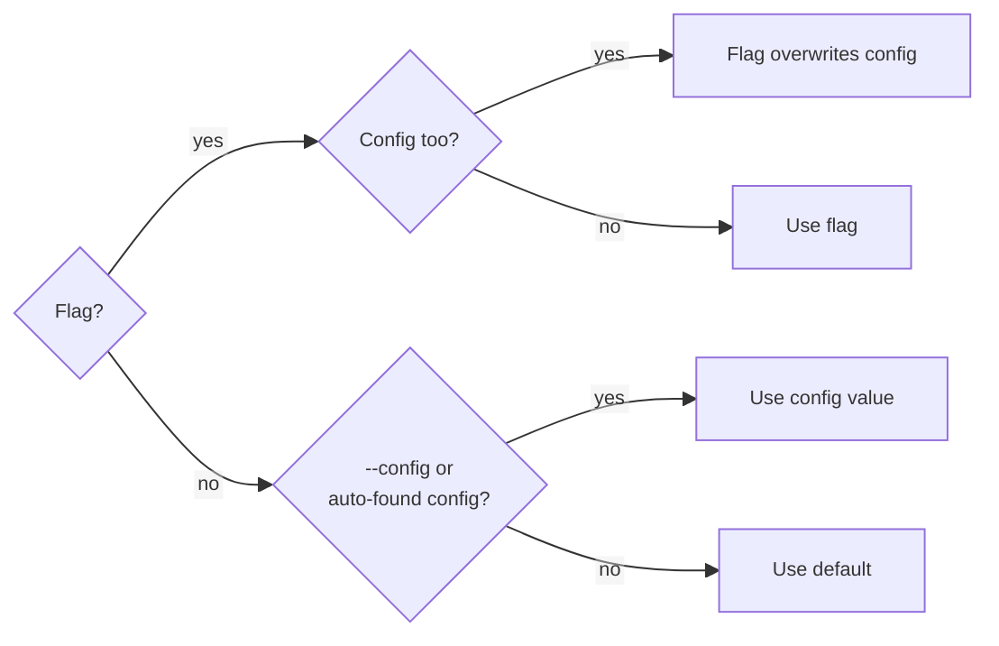

# Usage

Two entry points, both plain scripts at the package root — called directly, not with `python -m`. Run them from the host project's root: the corpus auto-search globs `workflows/<type>/*.yaml` relative to the working directory, and every path printed in a report is written relative to it too. </br> -> `checker.py` :  runs a chain once against a corpus and reports pass/fail. </br> -> `trainingLoop.py` :  repeats that same pass/fail logic over a fixed number of epochs and feeds the results to an LLM ("the modifier") that rewrites the chain's system prompt, trying to raise accuracy.

---

### Run it

```
(.venv)➜backend python chain_checker/checker.py
    (CHECKER) Running checker
    (CHECKER)   config: 'chain_checker/config.json'
    (CHECKER)   type: '<type>' (config)
    (CHECKER)   chain-type: 'template_checklist' (default)
    (CHECKER)   chain-tier: chain's own default (default)
    (CHECKER)   file: 'workflows/<type>/template_checklist.yaml' (config)
    (CHECKER)   prompt-file: none (default)
    (CHECKER)   continue: False (default)

    (CHECKER) Evaluating case (1)/(9) case-1...
    (CHECKER) Evaluating case (2)/(9) case-2...
    ...
    (CHECKER) 8/9 cases passed
    (CHECKER)-(REPORT) Report written to workflows/<type>/.temp/template_checklist/check_0/report.html
```

```
(.venv)➜backend python chain_checker/trainingLoop.py
    (R)-(MODIFIER) Starting a new run: workflows/<type>/.temp/template_checklist/run_0
    (R)-(MODIFIER) Running epoch 1/4...
    (R)-(MODIFIER) epoch 1/4 done - overall accuracy of 0.75, chain used 6840 tokens across 9 call(s) (avg 760.0/entry)
    (R)-(MODIFIER) Generating new prompt
    (R)-(MODIFIER) epoch 1/4 modifier LLM used 1180 tokens rewriting the prompt (cumulative across all epochs so far: 1180)
    ...
    (R)-(MODIFIER) Summary updated at workflows/<type>/.temp/template_checklist/run_0/summary/report.html
```

---

### Settings Parsing

Both tools resolve args the same way: </br>   1)  CLI flag wins, then an explicit `--config` file, </br>   2)  then `chain_checker/config.json`/`.yaml` if one exists (see [Config files](#config-files)). </br>   3)  A shared `config.json` in the chain_checker holds the defaults; one-off flags override just what changes for a run.



When starting a run the parameters and their value is printed to the log so uses are able to see with which configs the programm runs
```
(CHECKER) Running checker
(CHECKER)   config: 'chain_checker/config.json'
(CHECKER)   type: '<type>' (config)
(CHECKER)   chain-type: 'template_checklist' (default)
(CHECKER)   chain-tier: chain's own default (default)
(CHECKER)   file: 'workflows/<type>/template_checklist.yaml' (config)
(CHECKER)   prompt-file: none (default)
(CHECKER)   continue: False (default)
```

---

## Flags and Config

### checker

| Flag             | Default | Options | What it does                                                                       |
|------------------|---|---|------------------------------------------------------------------------------------|
| `--config`       | auto-search | any `.yaml`/`.json` path | Config file supplying any of these flags by name (see [Config files](#config-files)); `chain_checker/config.json`/`.yaml` is used automatically if omitted |
| `--type`         | tonality | app label with its own `workflows/<label>/chains/` package | App/chain family to run </br>- selects the `workflows/<type>/` folder the chain lives in |
| `--chain-type`   |  template_checklist | the `name` of any `@register` chain under that app's `chains/` package | Registered chain to run on.                                                        |
| `--chain-tier`   | chain's own `tier` | available LiteLLM Model Endpoints, e.g (fast/balanced/thinking) | Overrides the chain-under-test's declared `tier` class attribute instead of the LLM tier it normally calls - lets the same corpus be run against a different tier/model without editing the chain's source. Not `--modifier-tier` - that's the separate modifier LLM used by `trainingLoop.py`. |
| `--file`         |  auto-search | any `.yaml` path | Corpus file to run against</br>- `.yaml` filepath</br>- auto-search searches for a single `.yaml` in `workflows/<type>/`</br> |
| `--prompt-file`  | none | any text file path | Candidate `SYSTEM_PROMPT` to test instead of the chain's real one, without editing source — see [below](#test-a-hand-written-prompt-without-touching-the-chains-source) |
| `--continue`     | off | flag — present or absent, takes no value | Recall cases already predicted in the **newest** existing `check_N` made with *this* run's prompt and chain config (`--type`/`--chain-type`/`--chain-tier` + `SYSTEM_PROMPT`) instead of calling the model for them again, run only what's still missing, then write the report. A `check_N` made with anything else is never continued into — see [below](#continuations---continue) |

### trainingLoop
All the flags from [checker.py](#checker) are also optional — **including `--chain-tier`**, which overrides the tier of the **chain being trained**. Don't confuse it with `--modifier-tier` below, which is the tier of the separate **modifier LLM** doing the rewriting — the two are independent and can be set to different tiers at the same time.

| Flag                               | Default      | Options                                                                                   | What it does                                                                                                                                                                                                                                              |
|------------------------------------|--------------|-------------------------------------------------------------------------------------------|-----------------------------------------------------------------------------------------------------------------------------------------------------------------------------------------------------------------------------------------------------------|
| `--continue`                       | off          | flag — present or absent, takes no value                                                  | Continue the **newest** existing run trained against *this* chain config (`--type`/`--chain-type`/`--chain-tier`) instead of starting a new one. A run trained against another tier is never continued into — see [below](#continuations---continue)     |
| `--epochs`                         | `4`          | integer in the range - [0,...)                                                            | Number of rewrite iterations (how oftan the prompt gets modified)                                                                                                                                                                                         |
| `--val-file`                       | none         | any `.yaml` path                                                                          | Held-out corpus, tested every epoch purely for reporting, never seen by the modifier — see [below](#a-held-out-validation-corpus---val-file)                                                                                                              |
| `--modifier-backend`               | `litellm`    | `litellm` \| `ollama`                                                                     | Which LLM runs **the modifier**. <br> - `litellm` routes through this project's proxy via `--modifier-app`'s credential; <br> - `ollama` calls a local server instead — `--modifier-model`/`--modifier-app`/`--modifier-tier` split along that line below |
| `--modifier-model`                 | `qwen3.5:4b` | any model name already pulled locally <br>e.g. `qwen3.5:4b`, `qwen3.5:30b`, `llama3.1:8b` | Ollama model for the modifier<br> - only read with `--modifier-backend ollama`; <br> - needs `ollama serve` running and the model already pulled (`ollama pull <name>`)                                                                                   |
| `--modifier-app`                   | `tonality`   | any registered app with a `LITELLM_API_KEY_<LABEL>` configured                            | Whose LiteLLM credential the modifier borrows <br> - only read with `--modifier-backend litellm`                                                                                                                                                          |
| `--modifier-tier`                  | `fast`       | available LiteLLM Model Endpoints, e.g (fast/balanced/thinking)                           | LiteLLM tier the modifier calls <br> - only read with `--modifier-backend litellm`                                                                                                                                                                        |

### Config files

An explicit `--config path.yaml` works the same on either tool (`.json` too):

```yaml
# my_run.yaml
type: <type>
chain-type: template_checklist
epochs: 6
```
```
(.venv)➜backend python chain_checker/trainingLoop.py --config my_run.yaml
(.venv)➜backend python chain_checker/trainingLoop.py --config my_run.yaml --epochs 10   # overrides just this one key
```

Keys use the flag's own spelling (`chain-type`, `continue`). A typo in an explicit `--config` fails loudly and lists the valid keys

---

### Improve the prompt automatically

```
(.venv)➜backend python chain_checker/trainingLoop.py --type <type> --chain-type template_checklist --epochs 4
```
```
(R)-(MODIFIER) Starting a new run: workflows/<type>/.temp/template_checklist/run_0
(R)-(MODIFIER) Running epoch 1/4...
(R)-(MODIFIER) epoch 1/4 done - overall accuracy of 0.75, chain used 6840 tokens across 9 call(s) (avg 760.0/entry)
(R)-(MODIFIER) Generating new prompt
(R)-(MODIFIER) epoch 1/4 modifier LLM used 1180 tokens rewriting the prompt (cumulative across all epochs so far: 1180)
...
(R)-(MODIFIER) Summary updated at workflows/<type>/.temp/template_checklist/run_0/summary/report.html
```

The modifier (the LLM rewriting the prompt) is always separate from the chain's own LLM. 
<br>`--modifier-xx` flags adjust the modifier model

---

### Continuations (`--continue`)

Both tools support `--continue`, but not the same thing - `checker.py` has no epochs to resume, so its `--continue` only ever recalls already-answered cases within one run.

#### checker

Without `--continue`, every invocation starts a fresh `check_N` and calls the model for every case, even if an identical run already exists:

```
(.venv)➜backend python chain_checker/checker.py --type <type> --chain-type template_checklist --chain-tier fast   # -> check_0_fast
(.venv)➜backend python chain_checker/checker.py --type <type> --chain-type template_checklist --chain-tier fast   # -> check_1_fast, check_0_fast untouched
```

`--continue` finds the **newest** existing `check_N` whose saved `prompt.txt`/`config.json` match this run's prompt and `{type, chain, tier}`, and recalls whatever's already saved in its `entries/` instead of calling the model again, then runs only the cases still missing before writing the report:

```
(.venv)➜backend python chain_checker/checker.py --type <type> --chain-type template_checklist --chain-tier fast --continue
    (CHECKER) --continue: recalling cached predictions from workflows/<type>/.temp/template_checklist/check_0_fast
    (CHECKER) 7/9 case(s) recalled from workflows/<type>/.temp/template_checklist/check_0_fast/entries
    (CHECKER) Evaluating case (8)/(9) case-8...
    (CHECKER) Evaluating case (9)/(9) case-9...
    (CHECKER) 8/9 cases passed
    (CHECKER)-(REPORT) Report written to workflows/<type>/.temp/template_checklist/check_0_fast/report.html
```

The match is made on those two saved files, never on the directory name — the `_<tier>` suffix is cosmetic, the real tier lives in `config.json`. A `check_N` that doesn't match is **skipped, not reused**: it keeps its cached predictions and its `report.html`, and this run starts a fresh `check_N` beside it.

- **A different `--chain-tier`** → the other tier's run is left alone, this one gets its own dir
- **A `--prompt-file`**, or a `SYSTEM_PROMPT` edited in the chain's source since → same, the cached predictions describe the old prompt
- **Nothing matching at all** → `--continue` says which runs it found and why it skipped them, then starts fresh
- **No `check_N` at all yet** → says so and starts a fresh one, same as omitting the flag

```
(.venv)➜backend python chain_checker/checker.py --chain-tier fast --continue   # after a thinking run
    (CHECKER) --continue given, but none of the 1 existing run(s) under workflows/<type>/.temp/template_checklist was made with this run's prompt and chain config (tier 'fast') - the newest, 'check_0_thinking', differs. Leaving them untouched and starting fresh in workflows/<type>/.temp/template_checklist/check_1_fast instead.
```

If nothing new is added between two entries dropped into the same `entries/` folder (e.g. by a prediction run made on another machine, per [above](#files-a-checker-run-produces)), `--continue` recalls all of it and only writes the report - no model call happens at all. Such a drop-in has to carry its own `prompt.txt`/`config.json` to be recognised, exactly as before.

#### trainingLoop

Without `--continue`, every invocation starts a fresh, independent `run_N` (`run_0`, `run_1`, ...) from the chain's real original prompt:

```
(.venv)➜backend python chain_checker/trainingLoop.py --type <type> --chain-type template_checklist --modifier-model qwen3.5:4b   # -> run_0
(.venv)➜backend python chain_checker/trainingLoop.py --type <type> --chain-type template_checklist --modifier-model qwen3.5:30b  # -> run_1, run_0 untouched
```

Once 2+ runs exist, a side-by-side comparison appears automatically at `workflows/<type>/.temp/<chain-type>/runs_overview.html`.

`--continue` finds the *newest* `run_N` trained against this same chain config and continues that run until number of provided epochs are reached, picking up exactly where it left off. Also runs which stopped mid epoch are continued exactly at the entry they stopped.

```
(.venv)➜backend python chain_checker/trainingLoop.py  --epochs 4    # runs epoch 1-4
(.venv)➜backend python chain_checker/trainingLoop.py  --epochs 8 --continue   # picks up from epoch 4, adds 5-8
```

Resumes cleanly from where it stopped; <br>If every requested epoch is already done, it says so and exits. The modifier's own memory of earlier epochs survives too — its history is replayed back in from disk before resuming, so its next rewrite still sees every prior epoch, not just this process's own.

Which run may be continued is decided by the `{type, chain, tier}` in each run's first epoch, not by the `_<tier>` suffix in its name. A run trained against **another tier** is skipped rather than extended — appending this tier's epochs to it would leave one `run_N` whose epochs were trained against two different models, and one `summary` averaging over both:

```
(.venv)➜backend python chain_checker/trainingLoop.py --chain-tier fast --epochs 4 --continue   # after a thinking run
    (R)-(MODIFIER) --continue given, but none of the 1 existing run(s) under workflows/<type>/.temp/template_checklist was trained against this chain config (tier 'fast') - continuing one of them would mix two tiers into a single run. Leaving them untouched and starting workflows/<type>/.temp/template_checklist/run_1_fast fresh instead.
```

Unlike the checker's `--continue`, only the config is compared, never the prompt — rewriting the prompt every epoch is what a training run *is*, so a prompt that has moved on is the normal case, not a mismatch. `--prompt-file` is therefore still ignored when resuming past epoch 0, as [above](#flags-and-config).

---

### Validation Corpus (`--val-file`)

By default the modifier only sees the corpus it's improving against, so it's easy to fix exactly the false examples shown without generalizing. <br>`--val-file` tests the current prompt on a *second* dataset every epoch:

```
(.venv)➜backend python chain_checker/trainingLoop.py --file workflows/<type>/corpus.yaml --val-file workflows/<type>/val/template_checklist_val.yaml
```

Val results are **purely for reporting** — the modifier never reads them. If train accuracy climbs but val doesn't, it's overfitting the training examples rather than learning the actual rule. Every report gains train/val side by side once used.

---

### Files a checker run produces

Under `workflows/<type>/.temp/<chain-type>/`:

```
check_0/                       (or check_0_<tier>, when --chain-tier is set)
  prompt.txt                    the resolved prompt this run used (placeholders already filled in)
  config.json                  {"type", "chain", "tier"} - used to detect a stale cache
  entries/<id>.txt              one saved prediction per corpus case that answered
  failures/<id>.txt             the raw prompt/reply of a case that raised - read, not cache
  report.html                   this run's accuracy/token-usage/mispredictions report
  metrics.json                  this run's full metrics, as data
check_1/
  ... (a separate attempt - e.g. a different --chain-tier - same layout, next number)
```

`entries/<id>.txt` and the two cache files (`prompt.txt`, `config.json`) are exactly what `--continue` (below) reads back in - and, being on disk in that same shape, they're just as happy to be dropped in from anywhere else that produces them the same way (e.g. a prediction run made on another machine), not only from a `checker.py` run itself.

`failures/` is **not** part of that cache. Only a case that actually answered gets an `entries/<id>.txt`; a case that raised has no prediction to cache, so its transcript is written here instead and `--continue` retries the case rather than recalling it. Saved under `entries/`, its empty output would come back as a real answer - never retried, scored as a wrong judgment instead of the parsing failure it was, and counted toward Parsing-Metrics' `parsed`.

---

### Files a training run produces

Under `workflows/<type>/.temp/<chain-type>/`:

```
run_0/
  modification_0/
    prompt.txt                the resolved prompt this epoch used (placeholders already filled in)
    config.json                {"type", "chain", "tier"} - used to detect a stale cache
    entries/<id>.txt          one saved prediction per corpus case
    report.html                this epoch's accuracy/token-usage/mispredictions report
    metrics.json               this epoch's full metrics, as data
    modifier_instruction.txt   the exact text sent to the modifier LLM
    modifier_output.txt        the modifier's raw reply (before extraction)
    modifier_new_prompt.txt    the prompt the modifier decided on
    modifier_token_usage.json  the modifier's own token cost for this epoch
  modification_1/
    ...
  modification_N/              (N = --epochs) an extra validation-only pass -
                                tests the last suggestion, asks for nothing further -
                                metrics.json has "final_validation_only": true instead
  summary/
    report.html                 trend charts across every epoch of run_0 so far
run_1/
  ... (a separate attempt - e.g. a different --modifier-model - same layout)
runs_overview.html            run_0 vs. run_1 vs. ..., once 2+ runs exist
```

---

### External Prompt

Write a candidate prompt to a plain text file. The generateSystemPrompt function is still called on that prompt the file Content simply replaces the content of the SYSTEM_PROMPT variable.

<table>
<tr><td><b>candidate.txt</b></td></tr>
<tr><td><sub>File&nbsp;&nbsp;&nbsp;Edit&nbsp;&nbsp;&nbsp;Format&nbsp;&nbsp;&nbsp;View&nbsp;&nbsp;&nbsp;Help</sub></td></tr>
<tr><td>

```text
You review marketing text for brand compliance.

Rules:
{tonality_rules}

Check the text against the rules and report your findings as JSON with
exactly this shape, one item per rule listed above:
{{
  "items": [
    {{"rule_id": "<the rule's id>", "description": "<the rule's requirement>", "passed": true or false, "evidence": "<short reason>"}}
  ]
}}
```

</td></tr>
</table>

Run it with the --prompt-file flag

```
(.venv)➜backend python chain_checker/checker.py --prompt-file /tmp/candidate.txt
```
```
(CHECKER) Using candidate prompt from '/tmp/candidate.txt' instead of chain 'template_checklist's real SYSTEM_PROMPT
(CHECKER) Evaluating case (1)/(9) case-1...
...
```
